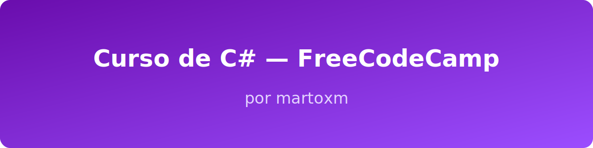

🌟 Curso de C# — FreeCodeCamp
🧑‍💻 Repositório de Estudos por @martoxm

  <picture>
    
  </picture>

  <picture>
    
  </picture>
  <picture>
    
  </picture>
  <picture>
    
  </picture>

  

👨‍🚀 Sobre Mim
Olá! Sou Gabriel, desenvolvedor em constante evolução e apaixonado por tecnologia.
Este repositório é meu espaço de prática, estudo e experimentação com C# e .NET.
📌 GitHub: github.com/martoxm

📚 Conteúdo do Repositório
Aqui você encontrará:
- ✔️ Exercícios resolvidos
- ✔️ Projetos práticos
- ✔️ Anotações e resumos
- ✔️ Códigos comentados
- ✔️ Experimentos pessoais

📦 csharp-freecodecamp
- ┣  📁 01-fundamentos
- ┣ 📁 02-estruturas-de-controle
- ┣ 📁 03-coleções
- ┣ 📁 04-poo
- ┣ 📁 05-projetos
- ┣ 📄 .gitattributes
- ┣ 📄 capa.svg
- ┣ 📄 LICENSE
- ┗ 📄 README.md

🧭 Progresso no Curso
📘 Módulos
- [ ] Fundamentos
- [ ] Estruturas de Controle
- [ ] Coleções
- [ ] Programação Orientada a Objetos
- [ ] Projetos Práticos
- [ ] Revisão Geral
🎯 Objetivos Pessoais
- [x] Criar repositório organizado
- [ ] Documentar exercícios
- [ ] Criar mini-projetos em C#
- [ ] Publicar projetos no GitHub Pages
- [ ] Criar um portfólio com C#

🧭 Como Executar
- Instale o .NET SDK
- Clone o repositório:
- 
- Entre na pasta desejada:
cd 01-fundamentos
- Execute o projeto:
dotnet run

🤝 Contribuições
Sugestões, melhorias e PRs são sempre bem-vindos.
Aprender junto é sempre mais divertido.

⭐ Apoie o Repositório
Se este conteúdo te ajudou ou inspirou, considere deixar uma estrela ⭐ no repositório.

